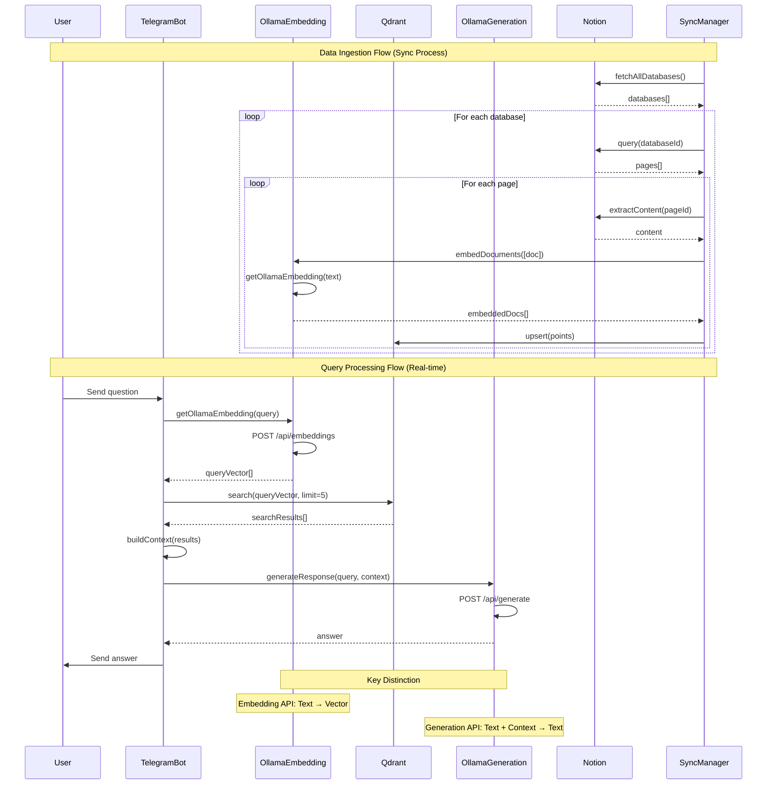

# Telegram-Driven Semantic Q&A Bot - Implementation Plan

## 🎯 Project Overview

Building a personal AI assistant that:
- Accepts questions via **Telegram channel** (not direct messages)
- Searches your **private knowledge base** (Notion, etc.)
- Answers using **local LLM via Ollama**
- Stores semantic content in **Qdrant**
- Provides real-time Q&A capabilities

## 📊 System Architecture

### Sequence Diagram



*If the diagram above doesn't render properly, you can also view it as a separate file: [system-architecture.md](./system-architecture.md)*

**To generate the diagram as an image:**
```bash
# Run the diagram generation script
node scripts/generate-diagram.js

# Or use the online Mermaid editor:
# 1. Go to https://mermaid.live/
# 2. Copy the diagram content from system-architecture.md
# 3. Export as PNG/SVG
```

## 🏗️ Current State Analysis

### ✅ Already Implemented
- **Notion Integration**: Page parsing and content extraction
- **Ollama Client**: Basic LLM generation (`src/llm/ollama-client.ts`)
- **Ollama Embedder**: Text embedding (`src/embed/ollama-embedder.ts`)
- **Qdrant Integration**: Storage and search (`src/agents/notion-agent.ts`)
- **Basic Telegram Bot**: Direct message handling (`src/telegram/query-bot.ts`)

### 🔄 Needs Enhancement
- **Channel-based Telegram Bot**: Currently only handles direct messages
- **Context Building**: Better context construction from search results
- **Error Handling**: Robust error handling and fallbacks
- **Configuration**: Environment-based configuration
- **Logging**: Structured logging for debugging

## 📁 Enhanced File Structure

```
src/
├── agents/
│   ├── notion-agent.ts          # ✅ Existing: Notion + Qdrant
│   ├── qa-agent.ts             # 🆕 New: Q&A orchestration
│   └── channel-agent.ts        # 🆕 New: Channel-specific logic
├── embed/
│   ├── ollama-embedder.ts      # ✅ Existing: Ollama embeddings
│   ├── embedder.ts             # ✅ Existing: Base embedder
│   └── query-embedder.ts       # 🆕 New: Query-specific embedding
├── llm/
│   ├── ollama-client.ts        # ✅ Existing: Basic Ollama client
│   └── context-builder.ts      # 🆕 New: Context construction
├── telegram/
│   ├── channel-bot.ts          # 🆕 New: Channel-based bot
│   ├── query-bot.ts           # ✅ Existing: Direct message bot
│   └── types.ts               # 🆕 New: Telegram types
├── constants.ts               # ✅ Existing: App constants
└── types.ts                   # ✅ Existing: Base types
```

## 🔧 Implementation Steps

### Phase 1: Enhanced Telegram Bot (Channel Support)

#### 1.1 Create Channel Bot (`src/telegram/channel-bot.ts`)
```typescript
// Key differences from current query-bot.ts:
// - Listen to channel messages, not direct messages
// - Handle channel-specific permissions
// - Support for multiple allowed channels
// - Better error handling and logging
```

#### 1.2 Environment Configuration
```env
# Telegram Configuration
TELEGRAM_BOT_TOKEN=your_bot_token
TELEGRAM_ALLOWED_CHAT_IDS=channel1_id,channel2_id
TELEGRAM_BOT_USERNAME=your_bot_username

# Ollama Configuration
OLLAMA_HOST=http://localhost:11434
OLLAMA_EMBEDDING_MODEL=llama2
OLLAMA_GENERATION_MODEL=llama2

# Qdrant Configuration
QDRANT_URL=http://localhost:6333
QDRANT_API_KEY=your_api_key
```

### Phase 2: Enhanced Embedding Pipeline

#### 2.1 Query Embedder (`src/embed/query-embedder.ts`)
```typescript
// Specialized for query embedding:
// - Optimized for question embedding
// - Better error handling
// - Fallback strategies
// - Caching for repeated queries
```

#### 2.2 Context Builder (`src/llm/context-builder.ts`)
```typescript
// Smart context construction:
// - Relevance scoring
// - Context length optimization
// - Source attribution
// - Metadata enrichment
```

### Phase 3: Enhanced Q&A Agent

#### 3.1 Q&A Agent (`src/agents/qa-agent.ts`)
```typescript
// Orchestrates the entire Q&A flow:
// - Query processing
// - Embedding generation
// - Semantic search
// - Context building
// - LLM generation
// - Response formatting
```

#### 3.2 Channel Agent (`src/agents/channel-agent.ts`)
```typescript
// Channel-specific logic:
// - Message filtering
// - Rate limiting
// - User permissions
// - Channel-specific responses
```

## 🚀 Key Features to Implement

### 1. Channel Message Handling
- **Message Filtering**: Only process messages from allowed channels
- **Bot Commands**: `/help`, `/status`, `/search`
- **Rate Limiting**: Prevent spam and abuse
- **Error Responses**: User-friendly error messages

### 2. Enhanced Context Building
- **Relevance Scoring**: Weight search results by relevance
- **Context Length**: Optimize for LLM token limits
- **Source Attribution**: Include source information in responses
- **Metadata Enrichment**: Add timestamps, authors, etc.

### 3. Robust Error Handling
- **Ollama Connection**: Handle Ollama service unavailability
- **Qdrant Connection**: Handle Qdrant service issues
- **Embedding Failures**: Fallback to simple text matching
- **Generation Failures**: Provide helpful error messages

### 4. Monitoring & Logging
- **Request Logging**: Log all queries and responses
- **Performance Metrics**: Track response times
- **Error Tracking**: Monitor and alert on failures
- **Usage Analytics**: Track bot usage patterns

## 🔄 Data Flow Architecture

### 1. Data Ingestion Flow (Sync Process)
```
Notion → Content Extraction → Ollama Embedding → Qdrant Storage
```

### 2. Query Processing Flow (Real-time)
```
Telegram Message → Query Embedding → Qdrant Search → Context Building → LLM Generation → Response
```

## 🛠️ Technical Specifications

### Ollama Integration
- **Embedding Model**: `llama2` (or `mistral`, `codellama`)
- **Generation Model**: `llama2` (or `mistral`, `codellama`)
- **API Endpoints**: 
  - `/api/embeddings` for vector generation
  - `/api/generate` for text generation
- **Fallback Strategy**: Simple hash-based vectors if Ollama fails

### Qdrant Integration
- **Collection Name**: `knowledge_base`
- **Vector Size**: 1536 (Ollama default)
- **Distance Metric**: Cosine similarity
- **Search Strategy**: Top-K with relevance threshold

### Telegram Bot Features
- **Channel Support**: Listen to specific channels
- **Message Types**: Text, commands, mentions
- **Response Types**: Text, markdown, inline keyboards
- **Rate Limiting**: Per-user and per-channel limits

## 📋 Implementation Checklist

### Phase 1: Core Channel Bot
- [ ] Create `src/telegram/channel-bot.ts`
- [ ] Implement channel message handling
- [ ] Add environment configuration
- [ ] Test channel message reception
- [ ] Add basic error handling

### Phase 2: Enhanced Embedding
- [ ] Create `src/embed/query-embedder.ts`
- [ ] Implement query-specific embedding
- [ ] Add embedding caching
- [ ] Test embedding pipeline
- [ ] Add fallback strategies

### Phase 3: Context Building
- [ ] Create `src/llm/context-builder.ts`
- [ ] Implement smart context construction
- [ ] Add relevance scoring
- [ ] Test context building
- [ ] Optimize for token limits

### Phase 4: Q&A Orchestration
- [ ] Create `src/agents/qa-agent.ts`
- [ ] Implement complete Q&A flow
- [ ] Add performance monitoring
- [ ] Test end-to-end pipeline
- [ ] Add comprehensive logging

### Phase 5: Production Features
- [ ] Add rate limiting
- [ ] Implement bot commands
- [ ] Add user-friendly error messages
- [ ] Create monitoring dashboard
- [ ] Add usage analytics

## 🧪 Testing Strategy

### Unit Tests
- Embedding generation
- Context building
- Qdrant search
- Ollama client

### Integration Tests
- End-to-end Q&A flow
- Channel message handling
- Error scenarios
- Performance benchmarks

### Manual Testing
- Telegram bot commands
- Channel message processing
- Error handling
- Response quality

## 🚀 Deployment Strategy

### Development Environment
- Local Ollama instance
- Local Qdrant instance
- Telegram bot in development mode
- Hot reloading for development

### Production Environment
- Ollama on dedicated server
- Qdrant cloud or dedicated instance
- Telegram bot with webhook
- Monitoring and alerting

## 📊 Success Metrics

### Performance Metrics
- **Response Time**: < 5 seconds average
- **Search Accuracy**: > 80% relevant results
- **Uptime**: > 99% availability
- **Error Rate**: < 5% failed requests

### Quality Metrics
- **User Satisfaction**: Response quality ratings
- **Context Relevance**: Manual review of context quality
- **Answer Accuracy**: Fact-checking against source material
- **User Engagement**: Message frequency and patterns

## 🔮 Future Enhancements

### Advanced Features
- **Multi-turn Conversations**: Remember conversation context
- **Voice Messages**: Speech-to-text integration
- **File Attachments**: Process uploaded documents
- **Scheduled Sync**: Automatic Notion synchronization
- **Multiple Sources**: Email, Calendar, Zoom integration

### AI Improvements
- **Fine-tuned Models**: Custom models for your domain
- **Better Embeddings**: Domain-specific embedding models
- **Hybrid Search**: Combine semantic and keyword search
- **Answer Confidence**: Confidence scoring for responses

---

## 🎯 Next Steps

1. **Review this plan** and provide feedback
2. **Prioritize features** based on your needs
3. **Start with Phase 1** (Channel Bot)
4. **Iterate and improve** based on testing
5. **Deploy incrementally** with monitoring

This plan provides a comprehensive roadmap for building your Telegram-driven semantic Q&A bot. Each phase builds upon the previous one, ensuring a solid foundation and gradual enhancement of capabilities. 