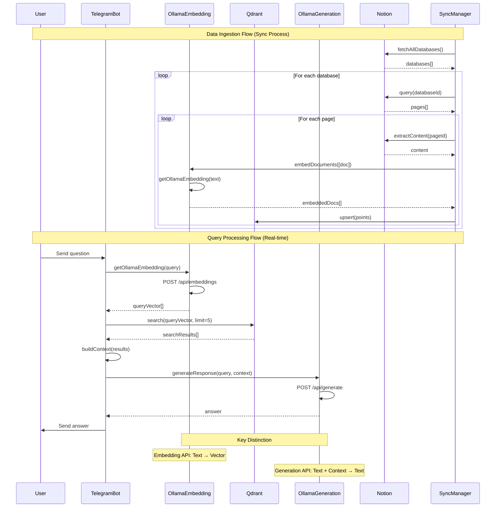

# Telegram Bot System Architecture

## Data Flow Sequence Diagram

## System Components

### Data Ingestion Flow (Sync Process)
1. **SyncManager** fetches all databases from Notion
2. For each database, queries all pages
3. For each page, extracts content and generates embeddings
4. Stores embedded content in Qdrant vector database

### Query Processing Flow (Real-time)
1. **User** sends question via Telegram channel
2. **TelegramBot** receives and processes the message
3. **OllamaEmbedding** converts question to vector
4. **Qdrant** performs semantic search for relevant content
5. **TelegramBot** builds context from search results
6. **OllamaGeneration** generates answer using context
7. **TelegramBot** sends response back to user

## Key Technologies
- **Telegram Bot API**: Channel message handling
- **Ollama**: Local LLM for embeddings and generation
- **Qdrant**: Vector database for semantic search
- **Notion API**: Content source and synchronization 